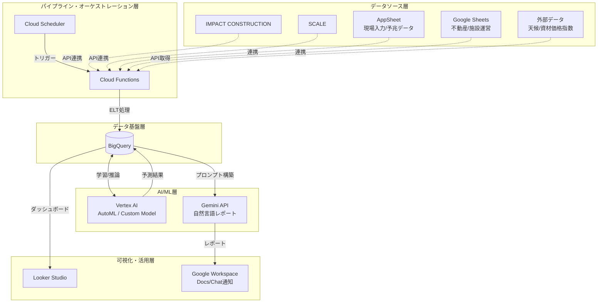
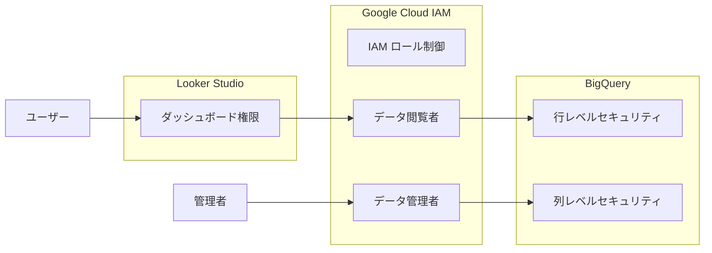
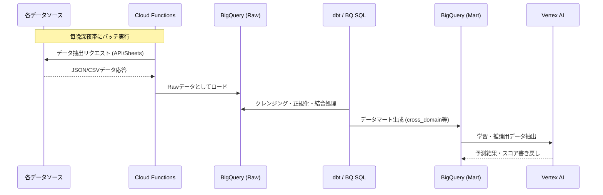

# 加和太建設 マルチドメインDXコックピット PoC システムアーキテクチャ設計書

> **Document Version:** 2.0 — PoC実装反映済
> **Last Updated:** 2026-08-02  
> **主要変更点:** BigQuery喳一データセット構成に変更、ビュー7本に増加、テーブルスキーマ実装値に更新

加和太建設（建設、不動産、施設運営、SaaS、エリアマネジメント）の多様な事業領域のデータを統合し、データドリブンな経営判断を支援する「マルチドメインDXコックピット」のアーキテクチャ設計です。既存のGoogle Workspace環境を最大限に活用し、Google Cloud（GCP）のデータ基盤・AIサービスを中核としたスケーラブルな構成を採用しています。

本アーキテクチャは、以下の3つの戦略的テーマの実現を目的としています：
1. **まちづくりROI可視化**: 建設、不動産、施設運営を統合したエリア単位の投資対効果の算出
2. **建設DXエコシステム可視化**: 自社SaaS（IMPACT CONSTRUCTION, SCALE）のKPIや利用状況のトラッキング
3. **AI原価予測**: 蓄積された過去データと外部要因を考慮した機械学習による原価予測および異常検知

## 2. システム構成図

### 2.1 全体システムアーキテクチャ
データの発生源から、蓄積、AIによる分析、そして可視化・レポーティングに至るデータフローの全体像です。

### 2.2 セキュリティ・アクセス制御アーキテクチャ

## 3. データソース層

多様な事業ポートフォリオに対応するため、各事業の特性に合わせたデータソースから情報を収集します。

- **IMPACT CONSTRUCTION (API連携)**
  - 建設部門の根幹データ（工事マスタ、実行予算、原価実績、入出金履歴など）をAPI経由で定期取得。
- **Google Sheets (不動産・施設運営データ)**
  - 「道の駅」等の施設運営データ（来場者数、店舗売上）、不動産事業データ（物件情報、賃貸収入）。既存の業務フロー（GAS等の自動化）を活用。
- **AppSheet (現場入力・予兆データ)**
  - 建設現場からの日報、非構造化データの構造化入力、ヒヤリハットやトラブル予兆の定性データを収集。
- **外部データ (External Data)**
  - AI原価予測の精度向上のため、気象庁API（天候・降水量）や建設物価調査会の資材価格指数を自動収集。

## 4. データ基盤層（BigQuery）

> **PoC実装決定:** データ管理のシンプル化のため、**喳一データセット `{PROJECT_ID}.kawata_dx_cockpit`** に全テーブルを集約。
> Phase 2以降にデータ量・権限要件が複雑化した際に複数データセット分割を検討する。

### 4.1 ベーステーブル

| テーブル名 | 話達データ | 主要カラム |
|:---|:---|:---|
| `projects_master` | 工事マスタ | `project_id`, `contract_amount_kpy`, `target_cost_rate`, `progress_rate`, `pm_name` |
| `cost_records` | 原価トランザクション | `project_id`, `category`, `amount_kpy`, `status`, `payment_due_month` |
| `cash_in_schedules` | 入金スケジュール | `project_id`, `expected_amount_kpy`, `actual_amount_kpy`, `deposit_month`, `status` |
| `real_estate_properties` | 不動産物件マスタ | `location`, `acquisition_cost_kpy`, `current_value_kpy`, `monthly_rental_income_kpy`, `occupancy_rate` |
| `facility_operations` | 施設月次運営実績 | `facility_name`, `month`, `visitors`, `revenue_kpy`, `operating_profit_kpy` |
| `saas_metrics` | SaaS事業KPI月次 | `product`, `month`, `mrr_kpy`, `customers`, `churn_rate` |
| `area_indicators` | エリア指標月次 | `area_name`, `month`, `land_price_index`, `population`, `foot_traffic` |

> 完全なカラム定義・英日対照表 → [`docs/column_dictionary.md`](./docs/column_dictionary.md)

### 4.2 分析ビュー（Looker Studio 直接参照先）

| ビュー名 | 用途 | Lookerページ |
|:---|:---|:---|
| `vw_company_dashboard` | 全社売上・利益率・進行中工事数・手元資金の月次集計 | Page 1 |
| `vw_area_roi` | エリア別投資總額・ROI率・事業別売上の横断集計 | Page 2 |
| `vw_area_indicators` ★ | エリア指標（地価・人口・歩行者数）の月次推移。`indicator_month` はDATE型 | Page 2 |
| `vw_project_cost_summary` | 工事別原価・粗利・PM名・リスクレベル | Page 3 |
| `vw_cost_category_detail` ★ | 外注費/材料費/労務費/経費のカテゴリ別予実比較。ドーナツ・棒グラフ用 | Page 3 |
| `vw_cashflow_forecast` | 期首/期末残高・入出金・資金ショートフラグ。`cf_date` はDATE型 | Page 4 |
| `vw_ml_features` | XGBoost学習用特徴量ビュー（`actual_cost_rate`ターゲット） | ML学習用 |

> ビューのSQL定義全文 → [`sql/01_views.sql`](./sql/01_views.sql)

## 5. AI/ML層（Vertex AI）

蓄積されたデータを価値に変えるための3つのAI機能を実装します。

1. **原価着地予測モデル (AutoML / Custom Models)**
   - **目的**: プロジェクト完了時の最終原価を高精度に予測
   - **アルゴリズム**: XGBoost または Prophet（時系列性重視）
   - **特徴量**: 過去の類似工事実績、進捗率、天候データ、最新の資材価格指数
2. **キャッシュフロー異常検知**
   - **目的**: 予算消化の急激な変動や、不自然な経費計上を早期発見
   - **アルゴリズム**: Isolation Forest または LSTMベースの時系列異常検知
3. **自然言語レポート生成 (Gemini API)**
   - **目的**: 経営陣向けの月次/週次の事業ハイライト自動生成
   - **処理**: BigQueryの集計結果と予実差異をプロンプトに埋め込み、Geminiにより要約テキストやアラート文章を生成し、Google ChatやDocsへ配信。

## 6. 可視化層（Looker Studio）

経営層から現場のプロジェクトマネージャーまで、役割に応じたインサイトを提供するダッシュボード群です。

- **全社経営サマリー**: 全事業（建設、不動産、SaaS等）の売上・利益サマリーと予実管理。
- **事業部別詳細（ドリルダウン）**: 各事業の主要KPI（例：SaaSのMRR推移、道の駅の客単価など）。
- **まちづくりROIトラッカー**: 特定の地域（例：三島市エリア）における建設投資、施設運営利益、エリア価値向上を統合した指標（ROI）の可視化。
- **AI予測・アラート画面**: Vertex AIが予測した原価超過リスクの高いプロジェクトのランキングと異常検知アラート。

## 7. データパイプライン設計

データの抽出(Extract)、ロード(Load)、変換(Transform)のELTプロセスを定義します。

## 8. セキュリティ・権限設計

Google Workspaceの既存グループ権限とGoogle Cloud IAMを統合します。

- **IAM ロール**:
  - `roles/bigquery.dataViewer`: 各部門のアナリスト（自身が所属する事業のデータセットのみアクセス可）
  - `roles/bigquery.admin`: DX推進室データエンジニア
- **行レベル・列レベルセキュリティ (RLS/CLS)**:
  - 建設原価の詳細や個人情報を含む列へのアクセスをDX推進室と経営層のみに制限。
  - Looker Studioの閲覧者のGoogleアカウントに基づき、表示されるデータを所属部門に限定（Row-Level Securityの活用）。

## 9.運用・監視設計

- **ジョブ監視**: Cloud Monitoringを使用し、Cloud Functionsの実行エラーや処理遅延を検知。
- **データ品質監視**: 必須項目のNull率や異常値のチェッククエリを日次で実行し、閾値を超えた場合はGoogle ChatのDX推進室チャンネルへアラート通知。
- **コスト管理**: BigQueryのクエリスキャン量に基づく予算アラートを設定。

## 10. 拡張性・将来構想

本PoCアーキテクチャは、加和太建設社内のDX推進に留まらず、将来的なスケールを前提としています。

1. **マルチテナント化への拡張**:
   将来的には、この「DXコックピット」自体を自社SaaS（IMPACT CONSTRUCTION等）の付加価値機能、あるいは新たなデータSaaSとして他の中堅建設会社へ展開可能な設計とする（BigQueryのデータセット分割やマルチテナントアーキテクチャの導入）。
2. **リアルタイム処理の導入**:
   IoTセンサー（現場の温湿度、重機の稼働状況）からのストリーミングデータをPub/Sub経由で統合し、よりリアルタイムな現場モニタリングを実現。
3. **Generative AIの高度活用**:
   Geminiを活用した社内規定や過去の施工トラブル事例を検索できるRAG（検索拡張生成）チャットボットを統合し、知識共有プラットフォーム「SCALE」の価値を最大化。
